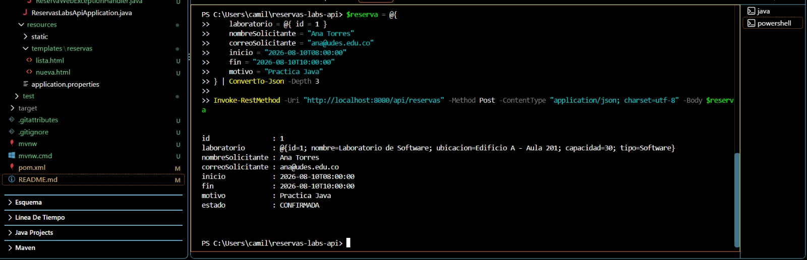
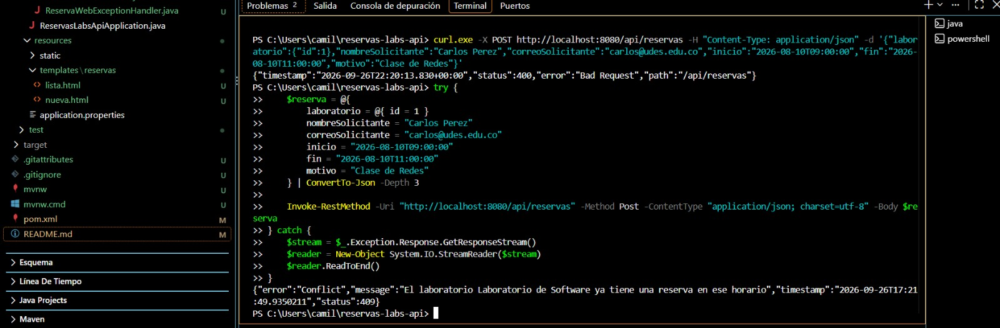
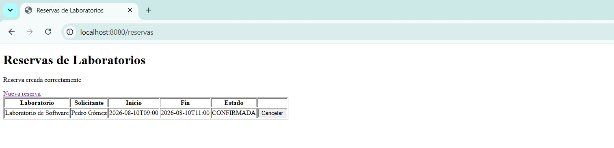
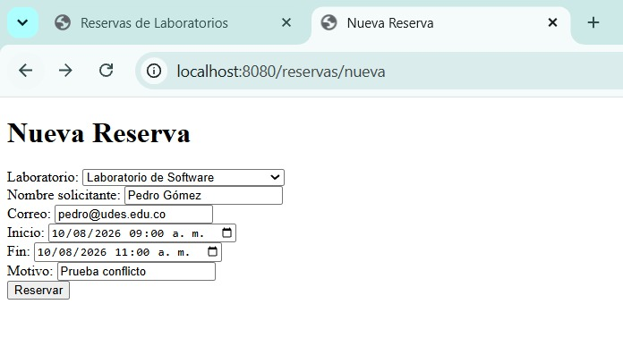
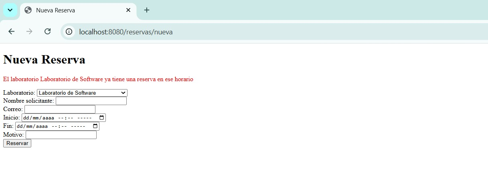

# Post-contenido — Unidad 5: Integración en Aplicaciones Web

## Descripción
Repositorio del post-contenido de la Unidad 5 de Patrones de Diseño
de Software. Un único proyecto Spring Boot (reservas-labs-api) para
la reserva de laboratorios de cómputo, con dos partes: una API REST
en capas (Entity, Repository, Service, Controller) sobre H2, y una
vista Thymeleaf (MVC clásico) que reutiliza el mismo Service.

# Decisiones de diseño
## Parte 1 — Repository, Service y Controller REST

### Punto de decisión 1: Ubicación de la validación de solapamiento de horarios

El filtrado de solapamientos se delega al motor de base de datos mediante la consulta JPQL personalizada buscarSolapamientos en ReservaRepository. Esta elección responde a razones de rendimiento y escalabilidad: realizar el filtrado en memoria trayendo todas las reservas hacia Java degradaría el desempeño a medida que crezca el volumen de datos.

Sin embargo, la decisión de negocio (interpretar si la lista no está vacía y lanzar ReservaConflictException) vive exclusivamente en ReservaService. El Repository solo responde a una consulta técnica de datos ("¿qué reservas se cruzan con este rango?"), mientras que el Service responde a una regla de dominio ("¿es válido crear esta reserva?").

#### ¿Qué pasaría si el Controller llamara directamente a buscarSolapamientos()?
Se rompería la arquitectura en capas y el principio de encapsulamiento. El controlador asumiría la responsabilidad de evaluar las reglas de negocio, acoplando la capa HTTP con el dominio y obligando a duplicar esa lógica si mañana se agrega otra interfaz (como una vista web MVC o una aplicación móvil).

---

### Punto de decisión 2: Reglas con y sin apoyo del Repository

Las reglas de negocio del sistema se clasifican según su necesidad de acceso a datos:

1. **Reglas con apoyo del Repository:** La validación de solapamiento requiere comparar la solicitud entrante contra reservas previamente guardadas. Al depender del estado global persistido, es indispensable apoyarse en el `Repository`.

2. **Reglas sin apoyo del Repository (Java puro):** La validación de horario de atención (07:00 a 21:00) y de duración (entre 30 minutos y 3 horas) vive enteramente en el método `validarHorarioDuracion` de `ReservaService`. Dado que estas reglas dependen únicamente de los atributos del propio objeto `Reserva` (`inicio` y `fin`), no hay razón para consultar la base de datos.

#### Criterio general

> Si una regla requiere consultar el estado de otros registros en el sistema, se apoya en el `Repository`.
>
> Si depende únicamente de las propiedades de la entidad que se está recibiendo, se valida en memoria dentro del `Service`.

---

## Parte 2: Vista MVC con Thymeleaf sobre el Mismo Service

### Punto de decisión 3: Compartición de la capa Service entre el Controller MVC y el Controller REST

`ReservaWebController` (MVC) y `ReservaController` (REST) comparten la lógica de negocio inyectando la misma clase `ReservaService`, la cual es gestionada por Spring como un bean singleton.

Ninguno de los dos controladores reimplementa las validaciones de solapamiento ni las restricciones de horario y duración, delegando esta responsabilidad directamente al servicio.

- **Alternativa descartada:** Copiar las reglas de validación dentro de `ReservaWebController` o crear un servicio web paralelo (`ReservaWebService`).

- **Justificación de la decisión:** Duplicar la lógica de negocio violaría el principio DRY (*Don't Repeat Yourself*) y generaría un problema de mantenibilidad. Cualquier modificación futura en las reglas de reserva tendría que replicarse manualmente en dos lugares, aumentando el riesgo de inconsistencias entre la API REST y la vista Web.

  La capa `Service` existe precisamente para centralizar el dominio y ser reutilizada por múltiples capas de presentación.

---

### Punto de decisión 4: Manejo de errores consistente entre MVC y REST

Se implementaron dos manejadores de excepciones separados mediante `@ControllerAdvice`:

- `GlobalRestExceptionHandler`: restringido a controladores REST.
- `ReservaWebExceptionHandler`: restringido a `ReservaWebController`.

- **Alternativa descartada:** Usar un único `@RestControllerAdvice` global para ambas superficies.

- **Justificación de la decisión:** Un `@RestControllerAdvice` serializa siempre la respuesta a formato JSON, mientras que el usuario en el navegador web (Thymeleaf) necesita una redirección HTTP con un mensaje de error legible en la interfaz HTML.

  Intentar detectar el encabezado `Accept` dentro de un único manejador añadiría condicionales innecesarios.

  Separar los manejadores según el tipo de controlador mantiene la responsabilidad única de cada capa de presentación, utilizando un único vocabulario de excepciones de dominio (`ReservaConflictException`, `RecursoNoEncontradoException`).

# Herramientas utilizadas

- **Java 17, Spring Boot 3.2, Spring Data JPA, H2, Thymeleaf**
- **Apache Maven, Postman/curl, Git, GitHub**

# Conclusiones

La implementación de esta arquitectura demostró la importancia de mantener una clara separación de responsabilidades entre la persistencia, la lógica de negocio y las capas de presentación.

Lo más desafiante de diseñar la lógica fue definir los límites exactos de cada regla: entender cuándo una validación requiere apoyarse en una consulta SQL eficiente y cuándo debe resolverse enteramente en memoria con Java puro.

Además, la reutilización de `ReservaService` tanto por la API REST como por la vista Thymeleaf evidenció cómo un diseño en capas bien estructurado previene la duplicación de código y simplifica el mantenimiento del sistema ante cambios futuros.

# Capturas de pantalla y evidencias

## API REST
* **Creación exitosa de reserva (`201 Created`):**
  

* **Error de solapamiento en API REST (`409 Conflict`):**
  

## Vista Web (Thymeleaf)
* **Listado de reservas (`/reservas`):**
  

* **Formulario de nueva reserva (`/reservas/nueva`):**
  

* **Error de solapamiento en vista Web (Redirección con mensaje en rojo):**
  